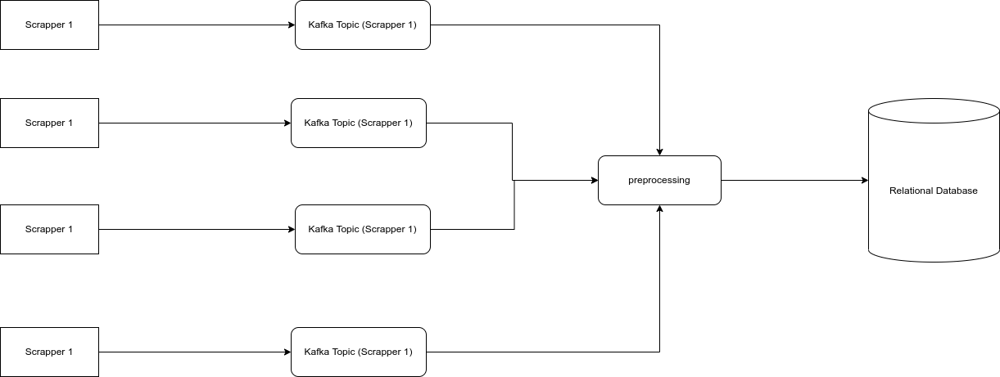

# Kafka Bridge

Kafka is the bridge between the Scrapper and Relational Database, for storing leads more efficiently.

## Reasons for using Kafka:
Relational Database implements the locking base system, So that if One process is writing to the database, other process can't write to the database. This is the reason why we are using Kafka, so that we can write to the kafka and then read from the kafka and write to the database sequentially. So that our scrappers can run in parallel.

# Architecture

